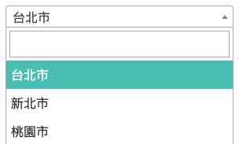
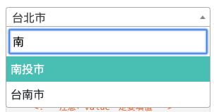
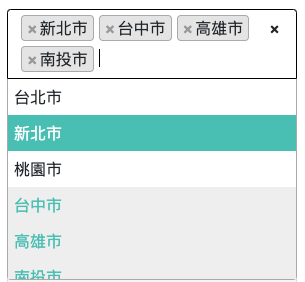

# select2

<!-- toc -->


- [About the Library](#about-the-library)
- [示意圖](#示意圖)
- [Installation](#installation)
- [Basic Usage](#basic-usage)  
- [線上資源](#%e7%b7%9a%e4%b8%8a%e8%b3%87%e6%ba%90)

<!-- tocstop -->

## About the Library

Select2 是一款基於jquery開發的下拉選單套件，可以優化select的操作，包括

- 支援單選與多選
- 可分組顯示
- 可用輸入文字檢索想要的項目
- 遠端取得數據功能 for 程式等
- broser支援度高 (IE 8+ / Chrome 8+ / FF 10+ / Safari 3+...)


## 示意圖


- 單選



- 檢索



- 多選




## Installation


```html
<!-- jquery -->
<script src="https://ajax.googleapis.com/ajax/libs/jquery/3.4.1/jquery.min.js"></script>
<!-- select2 -->
<link href="https://cdn.jsdelivr.net/npm/select2@4.0.13/dist/css/select2.min.css" rel="stylesheet" />
<script src="https://cdn.jsdelivr.net/npm/select2@4.0.13/dist/js/select2.js"></script>

```

## Basic Usage


```html
<select class="js-select2-id1" >
  <option value="01">台北市</option>
  <option value="02">新北市</option>
  <option value="03">桃園市</option>
  ...
</select>
```
```js
$(document).ready(function() {
    $('.js-select2-id1').select2();
});
```


## 線上資源

- [Lotte's Demo Site](https://lottevic.github.io/select2demo/src)

  
- [Official Select2 Website](https://select2.org/)
